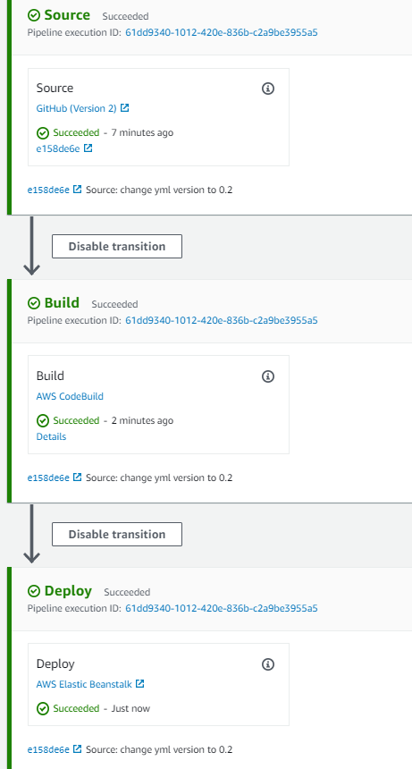

# Set up an AWS CodePipeline for CI/CD
This document wil guide you through setting up a DevOps pipeline using AWS CodePipeline and deploying it onto AWS Elastic Beanstalk running an AWS managed Docker platform, deploying the app into a Docker container.

<br>

### Tech Stack
- Spring Boot App with JDK 8
- GitHub (CI) with SonarCloud
- Docker
- AWS CodeBuild
- AWS CodeDeploy -> AWS Elastic Beanstalk
 
<br>

## Outline:
- [Step 1: Setup `Dockerfile`, & `buildspec.yml` in source code](#step1)

- [Step 2: Setup Deployment Environment in Elastic Beanstalk](#step2)
- [Step 3: Add Source Stage - Connect GitHub to CodePipeline](#step3)
- [Step 4: Add Build Stage - Setup CodeBuild Project](#step4)
- [Step 5: Create Pipeline - Commit, Build, Deploy!](#step5)

Once finished, you will have a Docker application running that automatically builds your software on commit, and deploys it to the Elastic beanstalk sitting behind a load balancer for scalability. This continuous integration pipeline will allow you to worry less about your deployments and get back to focusing on feature development within your application.

<br>


<br>

## Step 1: Setup `Dockerfile`, `docker-compose.yml`, & `buildspec.yml` <a name="step1"></a>

1. In your IDE, right click on your app and create a new file named `Dockerfile`.  Write the following instructions within it:

<br>

```Dockerfile
# Declare the base image - here is a light weight JDK 8 environment setup
FROM openjdk:8-jdk-alpine

# Copy the jar produced from the mvn clean package phase from the target to the inside of the container
COPY /target/YourApp-0.0.1-SNAPSHOT.jar YourApp-0.0.1-SNAPSHOT.jar

# Expose port 5000 of the container
EXPOSE 5000

# Run the JAR when you run the container, thus executing the app
ENTRYPOINT ["java", "-jar", "/YourApp-0.0.1-SNAPSHOT.jar"]
```

<br>

> ***How is the Dockerfile used?*** *The Dockerfile is a set of instructions that builds the image.* *During the **build** phase, managed by AWS CodeDeploy, we want to build an image defining the deployment environment (container) our app will run in within Elastic Beanstalk.*

<br>

2. Richt click on your project and create one more file named `buildspec.yml` within the project root directory. Paste the following within:

```yml
version: 0.2

phases:
  build:
    commands:
      - java -version
      - mvn clean package
artifacts:
  files:
    - 'Dockerfile'
    - target/RestApi-0.0.1-SNAPSHOT.jar
```

<br>

> ***How is the `buildspec.yml` file used?*** *You can read all about why this `buildspec` file is written the way it is [here](https://docs.aws.amazon.com/codebuild/latest/userguide/getting-started-cli-create-build-spec.html) :point_left: . During the **build** phase of our CodePipeline, AWS CodeBuild will read from this file and execute the steps we've outlined in the `build` phase: first displaying the version of java to the logs, then running `mvn clean package` to generate the `JAR` file which will be handed off to Elastic Beanstalk and run within a Docker container in the deployment phase.*

<br>

3. You're all done with your source code now. Time to `git push` it to your GitHub repository. :up:

<br>

## Step 2: Setup Deployment Environment in Elastic Beanstalk <a name="step2"></a>

1. Go to your AWS **Management** Console and login. In the search bar, look for **Elastic Beanstalk**

2. Click **Create Application**.

<br>


<br>

3. Give your application a name.

4. Under **Platform**, choose **Docker**.

5. Under **Application code**, choose **Sample application** > Click **Create application**.

<br>


<br>
 
*This step will take a few minutes to set up.  You have just defined the deployment environment which is the last stage in the pipeline.  The deployed `JAR` running in the container created and run in the **build** stage of the CodePipeline will replace the sample application currently running in your Elastic Beanstalk environment.* <br>

*Elastic Beanstalk is an easy way to let AWS configure your EC2 instances in which the app will be deployed, and easily auto-scale your resources.*

<br>

## Step 3: Add Source stage - Connect GitHub Repository to CodePipeline <a name="step3"></a>

1. In the AWS search bar, search for **CodePipeline**. Click **Create pipeline**.

2. Give the pipeline a name, and click next (let it create a New service role for you).

<br>


<br>

3. **Add source stage:** Under Source provide, click **Github (Version 2)**.

4. Under **Connection** click **Connect to GitHub** > give the connection a name and click **Connect to GitHub** again in the box that pops up.

5. Click **Install a new app**, this will take you to a GitHub installer for AWS Connector.  Click on your username/organization and click **Configure**.

6. In the Repository access page, click **Only select repositories** and select your recently publiched repository containing your source code.

<br>


<br>

7. You will be brought back to the AWS popup window after you've clicked **Save** in the repository access page. There will be a number referencing the connection you just configured.  Click **Connect**.

8. You should see a message saying you're "Ready to connect".  Add the **Repository name** and `main` **branch**. These should be available as an option to select.

9. Under, **Change detection options** make sure that ***Start the pipeline on source code change*** is checked. Click Next.


> *Whenever you **Continuously Integrate** (push code to the main branch, or accept a Pull Request from a separate branch into `main` of your repository), the CodePipeline will be triggered to rebuild, test, and deploy your app whenever there's a change in the source code.*

<br>

## Step 4: Add Build stage - Setup AWS CodeBuild Project <a name="step4"></a>

1. Under **Build provider**, choose **AWS CodeBuild**.

2. Under **Project name**, click **Create project**.  This will make a window pop up to configure the build job.

3. Enter a project name > make sure the box next to **Restrict number of concurrent builds this project can start** is *checked*, and **Concurrent build limit** is set to 1.

4. Under **Environment image**, click *Managed image*.

5. Under **Operating system** click *Amazon Linux 2* > **Runtime(s)** should be *Standard*.

6. Under **Image** click `aws/codebuild/amazonlinux2-aarch64-standard:1.0` 
    > *This is a Docker image that defines the Linux 2 environemnt. If you're interested, you can find the actual Dockerfile that this image is built from [here](https://github.com/aws/aws-codebuild-docker-images/blob/master/al2/aarch64/standard/1.0/Dockerfile), or go [here](https://docs.aws.amazon.com/codebuild/latest/userguide/build-env-ref-available.html) to the AWS documentation to learn more about these images.*

7. :exclamation: Under **Privileged**, make sure you check the box to give your builds "elevated priveleges" to build their own Docker images.

8. Scroll down to **Buildspec** > Check *Use a buildspec file* > Under **Buildspec name** write `buildspec.yml`.

<br>


<br>

9.  Scroll down to **Logs** (this is where the logs of your build sill be stored) > give a name for both *Group name* and *Stream name*.

10. Click **Continue to CodePipeline**. You'll be brought back to the Add build stage page with a message that says *Successfully created <your-build-project> in CodeBuild* > Make sure the **Build type** is set to *Single build* and click **Next**.

<br>

## Step 5: Add Deploy Stage - Commit, Build Deploy! <a name="step5"></a>

1. Under **Deploy Provider**, select *AWS ELastic Beanstalk*.

2. Select the *Application Name* of the app you set up in [Step 2](#step2) > Select the corresponding *Environment name* in the next box

3. Click **Next**.  You will be shown a summary of your CodePipeline.  Scroll to the bottom and click **Create pipeline**.

<br>

## Finished! :tada:
*Congrats! If your app deployed successfully within the pipeline, you should see the following:*

<br>



<br>

Under **deploy** you can click on the AWS Elastic Beanstalk link which will take you to your EC2's public IPv4 address. Click that and go to your actuator end point to confirm that your app is indeed up.  You're now accessing your app via the exposed port 5000 from the docker container running within an AWS EC2 (which is auto-generated by Elastic Beanstalk.)

If you go to `http://<your-beanstalk-environment>.eba-udukpxjr.us-east-2.elasticbeanstalk.com/api/actuator/health` you should be able to see the Spring Boot Actuator endpoint showing that its status is `UP` :tada:.
