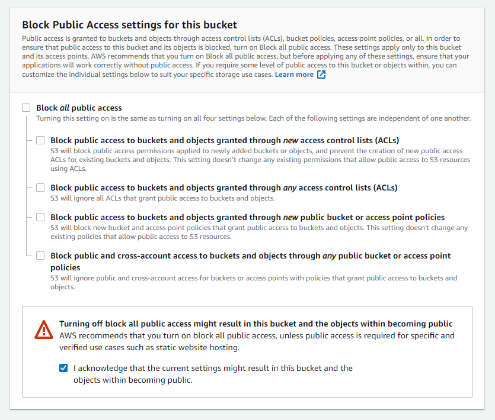
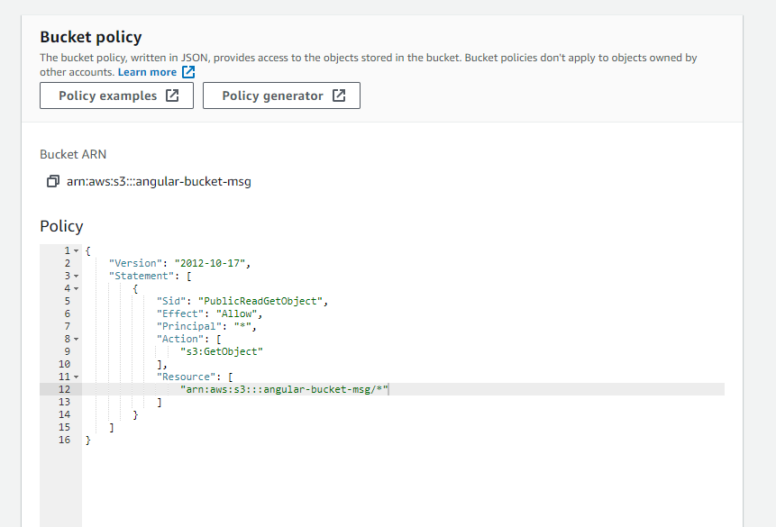
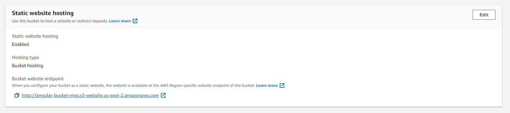
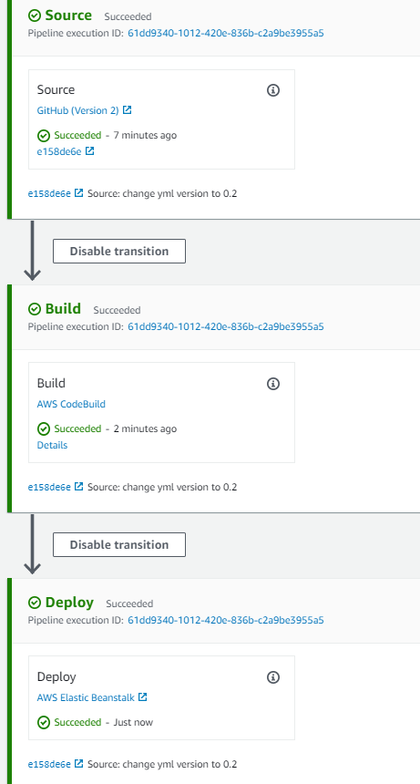

# How to Deploy This Angular App
*This is a step-by-step guide on how to deploy this app through AWS CodePipeline to an S3 bucket*

## Step 1: Add the  `buildspec.yml` file

1. Right click on the root directory of your Angular project > make a new file called `buildspec.yml`.  
> *This will be used by AWS CodeBuild in the pipeline to generate the deployable artifact by building it from your source code:*

<br>

```yml
# Do not change version. This is the version of aws buildspec, not the version of your buldspec file.
version: 0.2

env:
    variables:
        CACHE_CONTROL: "86400"
        S3_BUCKET: "{{S3_BUCKET}}"
        # This is the folder where the "built" version of your src code will go
        BUILD_FOLDER: "dist"
phases:
  install:
    runtime-versions:
        # We need node to install all the dependencies and built the distributable artifact
        nodejs: 14.5
    commands:
        - echo Installing source NPM dependencies...
        - npm install
        - npm install -g @angular/cli
  build:
    commands:
        - echo Build started 
        # ng build is the command you use when you're ready to build your app 
        # and deploy it. The CLI will analyze the application and build the 
        # files, all while optimizing the application as best as it can.
        - ng build
artifacts:
    files:
        - '**/*'
        # The CLI will then output the files in the dist/your-project-name folder, 
        # ready to be placed on a server and ready to be visited.
    base-directory: 'dist*'
    discard-paths: yes
```

<br>

2. Save and commit your code to your repository.

3. In the terminal of the root direcotry of your Angular project run `ng build --prod`.  The `dist/` folder has now been created.

<br>

## Step 2: Create an AWS S3 Bucket

1. Go to aws.com and search for **"S3 Bucket"** > Click **"Create Bucket"** > Give it a name (it must be unique).

2. Make sure you *uncheck* the checkbox next to **"Block *all* public access"** > acknowledge the warning below.

<br>



</br>

3. Enable Versioning.

4. Scroll donwn and click **Create Bucket** you will see that it has successfully been created on your S3 dashboard.

<br>

## Step 3: Enable Static Web Hosting in your S3 Bucket

1. Click on your bucket > underneath **Properties**, scroll down to **Static Website Hosting** > Click **Edit**. Currently this is disabled.  We need to change that.

2. Click **Enable** > Make sure "Hosting type" is set to "Host a static website".

3. Under **Index document** type `index.html`.  This is the name of the single page rendered in our Angular Single Page Application.

4. Click **Save Changes**.

5. Scroll back up to the top and click **Permissions** > Scroll Down, and next to **Bucket policy** click **Edit**.

6. If you navigate to the AWS documentation, you can find an [example permissions policy for hosting a Static website with S3](https://docs.aws.amazon.com/AmazonS3/latest/userguide/WebsiteAccessPermissionsReqd.html).  Copy and paste the example policy into your **Bucket Policy Configuration**.

7. Replace the `"Resource"` property with the **Bucket ARN** copied from above.

<br>



</br>

8. Click **Save Changes**. Your Bucket now has public access.

9. Go to 

9. Go back to the **Properties** section > Scroll down to the bottom of the page under **Static webstie hosting**.  There you will see the *Bucket website endpoint*.

<br>



</br>

10. **Add your Angular app's distributable files to the S3 bucket**:  
    - Open a terminal within the root directory of your Angular app.
    - Run: `ng build` > This will generate a `dist` folder
    - Open the **Obects** section of your @3 bucket's dashboard > Click Upload
    - In your file explorer click on your Angular app > `dist` > `your-angular-app-name` > copy all the files in there (about 7 - 8 should be in there) and upload them.

*Go back to the S3 `Properties` page > scroll down to the bottom where there's a link to your site.  If you click that link, you'll see your app hosted.*

<br>

## Step 3: Configure CodePipeline: Add Source
> *First, you will need to add the source code which will feed into the pipeline and trigger a build on commit.*

1. Search for CodePipeline on AWS > Click **Create Pipeline**.

2. Enter a Pipeline name and click next (the new service role should be generated automatically) > click next.

3. **Add source stage:** Under source provider select **GitHub (Version 2)**.

4. Click the box that says **Connect to GitHub** > Give the connection a name > Click Connect to GItHub > Click **Install a new app**.

5. Select the organization to connect to > clcik Configure > select the repository with your Angular source code and click Save > Click Connect when you're brought back to the previous popup window.

6. Select your *Repository name* & *branch* > Click Next.

<br>

## Step 4: Setup Build Stage of CodePipeline

1. Under Build Provide, select AWS CodeBuild > Click the box below that says **Create project**.

2. Give it a name >  under  *Managed Image* select **Amazon Linux 2** > Under Runtime(s), select **Standard** >  under *Image* select `aws/codebuild/amazonlinux2-x86_64-standard:3.0` > *Environment Type* is **Linux**

3. Under **Buildspec**, make sure *Use a buildspec file* is checked.  Under *buildspec name* write **buildspec.yml**. Make sure CloudWatch logs is checked > Make sure S3 logs is checked > Click **Continue to CodePipeline**. 

<br>

## Step 5: Add S3 Bucket URL Environment Variable 

1. Back in the build stage, click **Add environment variable**.  Here we will provide the value for `S3_BUCKET` which is referenced in your `build.yml` file.

2. Type `S3_BUCKET` under *Name*, and for *Value* paste the static web hosting url from the bottom of the Properties section of your S3 bucket's dashboard. Keeep the type as `Plaintext`.

3. Click Next.

<br>

## Step 6: Add Deploy Stage to CodePipeline

1. Under *Deploy provider*, select **Amazon S3**

2. Under *Bucket*, select your Bucket.

3. Make sure to check **Extract file before deploy** :exclamation: > Click Next.

<br>

## Step 7: Commit, Build, Deploy! :tada:
*Your pipelein should begin running with the source code that you've supplied it with.  Scroll to the bottom and click the link that the deploy stage directs you to to see your hosted web application!.*

<br>



<br>
