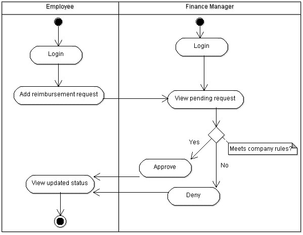

# Project-1: Employee Reimbursment System (ERS)
*Due Tuesday July 5th 2022*

## Executive Summary
* The Expense Reimbursement System (ERS) will manage the process of reimbursing employees for expenses incurred while on company time. 
* All employees in the company can login and submit requests for reimbursement and view their past tickets and pending requests. 
* Finance managers can log in and view all reimbursement requests and past history for all employees in the company. 
* Finance managers are authorized to approve and deny requests for expense reimbursement.

#### Tech Stack
Java 8, Servlet API, Apache Tomcat, Hibernate, PostgreSQL, HTML, CSS, JavaScript, Amazon EC2, Docker

* The back-end system shall use Hibernate which manages a connection to an **AWS RDS Postgres database**. 
* The application shall deploy onto a Tomcat Server, hosted remotely on an EC2. 
* The middle tier shall use Servlet technology for dynamic Web application development. 
* The front-end view shall use HTML/CSS/JavaScript to make an application that can call server-side components and be styled with CSS. 
* The middle tier shall follow proper layered architecture, and have reasonable test coverage of the service layer.

#### Employee User Stories 
- An Employee can login
- An Employee can view the Employee Homepage
- An Employee can logout
- An Employee can submit a reimbursement request
- An Employee can upload an image of his/her receipt as part of the reimbursement request (stretch goal)
- An Employee can view their pending reimbursement requests
- An Employee can view their resolved reimbursement requests
- An Employee can view their information
- An Employee can update their information
- An Employee receives an email when one of their reimbursement requests is resolved (optional)

#### Manager User Stories
- A Manager can login
- A Manager can view the Manager Homepage
- A Manager can logout
- A Manager can approve/deny pending reimbursement requests
- A Manager can view all pending requests from all employees
- A Manager can view images of the receipts from reimbursement requests (extra credit)
- A Manager can view all resolved requests from all employees and see which manager resolved it
- A Manager can view all Employees
- A Manager can view reimbursement requests from a single Employee 

**State-chart Diagram (Reimbursement Statuses)** 

**Reimbursement Types**

Employees must select the type of reimbursement as: LODGING, TRAVEL, FOOD, or OTHER.

**Logical Model**

**Physical Model**

**Use Case Diagram**

**Activity Diagram**

**Stretch Goals:** *These will count for extra credit and are entirely optional*
* Users can upload a document or image of their receipt when submitting reimbursements which can stored in the database and reviewed by a financial manager.
* Passwords shall be encrypted in Java and securely stored in the database. 
